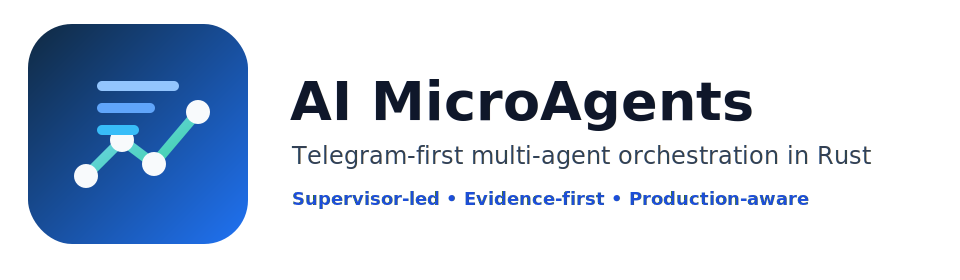
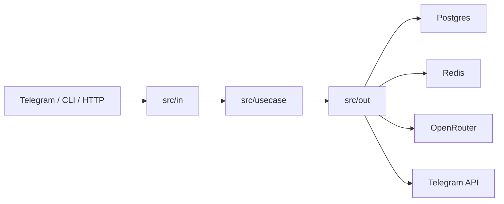

<p align="center">
  
</p>

<h1 align="center">AI MicroAgents</h1>

<p align="center">
  Telegram-first, evidence-aware, multi-agent orchestration in Rust.
</p>

<p align="center">
  <strong>Supervisor-led</strong> • <strong>Evidence-first</strong> • <strong>Production-aware</strong> • <strong>Operator-friendly</strong>
</p>

## What It Is
AI MicroAgents is a Rust runtime for orchestrating AI work through a bounded supervisor, persistent and ephemeral subagents, evidence-aware planning, and a live dashboard.

The system is optimized for:
- Telegram-first operation
- controlled cost and latency
- explicit planning and review loops
- strong observability
- contributor-friendly architecture based on `in / usecase / out`

## Why It Exists
Most agent systems are either:
- too opaque to operate safely,
- too generic to shape for real work,
- or too fragile once they touch real channels, memory, storage, and tools.

AI MicroAgents takes the opposite approach:
- orchestration is explicit,
- business logic is isolated in use cases,
- storage is durable,
- hot-path latency is protected,
- and current-data questions are grounded in external evidence instead of pure model priors.

## Core Capabilities
- Supervisor-led orchestration with bounded subagent delegation
- DAG-based planning with review and integration phases
- Dynamic model selection per task through the broker
- Telegram inbound/outbound support with multimodal handling
- Postgres as source of truth
- Redis for hot cache and secondary async work
- Redis Streams + outbox for non-blocking side-effects
- Live dashboard with Flow, Events, Config, and operational state
- Evidence-first handling for current-data and URL-based questions
- Conversation memory with recent turns, summaries, facts, and working set

## Architecture
All new Rust work follows three layers:
- `src/in`: adapters for external inputs such as CLI, HTTP, Telegram, polling, and webhooks
- `src/usecase`: business flows and orchestration logic
- `src/out`: adapters for Postgres, Redis, OpenRouter, Telegram outbound, jobs, and external integrations

Business logic belongs in `usecase`.



## Execution Model
A typical turn goes through these stages:
1. `ingest`
2. `context_load`
3. `classify`
4. `plan_if_needed`
5. `execute`
6. `integrate`
7. `deliver`

Current-data questions add an evidence stage before synthesis:
1. detect that live data is required
2. fetch evidence from allowed sources
3. build an evidence bundle
4. plan or synthesize only after evidence exists

## Repository Map
- [/Users/yasnielfajardo/Documents/PROJECTS/open-agent-team/src/in](/Users/yasnielfajardo/Documents/PROJECTS/open-agent-team/src/in)
- [/Users/yasnielfajardo/Documents/PROJECTS/open-agent-team/src/usecase](/Users/yasnielfajardo/Documents/PROJECTS/open-agent-team/src/usecase)
- [/Users/yasnielfajardo/Documents/PROJECTS/open-agent-team/src/out](/Users/yasnielfajardo/Documents/PROJECTS/open-agent-team/src/out)
- [/Users/yasnielfajardo/Documents/PROJECTS/open-agent-team/src/orchestrator](/Users/yasnielfajardo/Documents/PROJECTS/open-agent-team/src/orchestrator)
- [/Users/yasnielfajardo/Documents/PROJECTS/open-agent-team/src/planner](/Users/yasnielfajardo/Documents/PROJECTS/open-agent-team/src/planner)
- [/Users/yasnielfajardo/Documents/PROJECTS/open-agent-team/src/team](/Users/yasnielfajardo/Documents/PROJECTS/open-agent-team/src/team)
- [/Users/yasnielfajardo/Documents/PROJECTS/open-agent-team/src/storage](/Users/yasnielfajardo/Documents/PROJECTS/open-agent-team/src/storage)
- [/Users/yasnielfajardo/Documents/PROJECTS/open-agent-team/src/telemetry](/Users/yasnielfajardo/Documents/PROJECTS/open-agent-team/src/telemetry)
- [/Users/yasnielfajardo/Documents/PROJECTS/open-agent-team/skills](/Users/yasnielfajardo/Documents/PROJECTS/open-agent-team/skills)
- [/Users/yasnielfajardo/Documents/PROJECTS/open-agent-team/templates](/Users/yasnielfajardo/Documents/PROJECTS/open-agent-team/templates)
- [/Users/yasnielfajardo/Documents/PROJECTS/open-agent-team/docs](/Users/yasnielfajardo/Documents/PROJECTS/open-agent-team/docs)

## Quickstart
1. Copy the environment file:
```bash
cp .env.example .env
```
2. Start Postgres and Redis.
3. Set the required secrets in `.env`:
```bash
OPENROUTER_API_KEY=...
TELEGRAM_BOT_TOKEN=...
TELEGRAM_BOT_USERNAME=...
```
4. Validate the setup:
```bash
cargo run -- doctor
```
5. Run the runtime:
```bash
cargo run -- run
```
6. Open the dashboard:
- [http://localhost:8080/dashboard](http://localhost:8080/dashboard)

## Runtime Requirements
Minimum operational requirements:
- Rust toolchain from `rust-toolchain.toml`
- Postgres
- Redis
- OpenRouter API access
- Telegram bot token for production channel use

## Current Identity and Skills Model
Identity is code:
- [/Users/yasnielfajardo/Documents/PROJECTS/open-agent-team/IDENTITY.md](/Users/yasnielfajardo/Documents/PROJECTS/open-agent-team/IDENTITY.md)

Skills are code:
- [/Users/yasnielfajardo/Documents/PROJECTS/open-agent-team/skills](/Users/yasnielfajardo/Documents/PROJECTS/open-agent-team/skills)

Notable built-in and local skills:
- `memory.write`
- `memory.search`
- `reminders.create`
- `reminders.list`
- `http.fetch`
- `quality.verify`
- `market-data`
- `web-research`
- `theory-reasoning`
- `multi-source-synthesis`

## Contributor Workflow
### 1. Read the project rules
Start here:
- [/Users/yasnielfajardo/Documents/PROJECTS/open-agent-team/AGENTS.md](/Users/yasnielfajardo/Documents/PROJECTS/open-agent-team/AGENTS.md)

Also read the architecture skills before structural work:
- [/Users/yasnielfajardo/Documents/PROJECTS/open-agent-team/skills/_dev.in/SKILL.md](/Users/yasnielfajardo/Documents/PROJECTS/open-agent-team/skills/_dev.in/SKILL.md)
- [/Users/yasnielfajardo/Documents/PROJECTS/open-agent-team/skills/_dev.usecase/SKILL.md](/Users/yasnielfajardo/Documents/PROJECTS/open-agent-team/skills/_dev.usecase/SKILL.md)
- [/Users/yasnielfajardo/Documents/PROJECTS/open-agent-team/skills/_dev.out/SKILL.md](/Users/yasnielfajardo/Documents/PROJECTS/open-agent-team/skills/_dev.out/SKILL.md)

### 2. Respect the architecture
- put transport logic in `in`
- put business flows in `usecase`
- put infrastructure and providers in `out`
- add Spanish comments for important business steps inside use cases

### 3. Validate before proposing changes
Run:
```bash
cargo fmt --all --check
cargo clippy --all-targets -- -D warnings
cargo test
```

### 4. Keep current-data answers grounded
If the question depends on current data:
- do not answer from pure model priors
- fetch evidence first
- synthesize after evidence exists

## Dashboard
The dashboard provides:
- operational overview
- live flow graph
- recent events
- runtime configuration
- bus and stream health
- team and subagent visibility

If dashboard auth is configured, send either header:
- `x-ai-microagents-dashboard-token`
- `x-ferrum-dashboard-token` (legacy compatibility)

## Storage Strategy
- Postgres: source of truth
- Redis: hot cache + async side-effects + streams

The reply path stays local and durable.
Redis is used to reduce latency and decouple non-critical work, not to replace the core turn queue.

## Commands
```bash
cargo run -- init
cargo run -- run
cargo run -- dashboard
cargo run -- doctor
cargo run -- replay <event_id>
cargo run -- chat --stdin
cargo run -- team status
cargo run -- team simulate
cargo run -- identity lint
cargo run -- skills lint
cargo run -- export-trace <conversation_id>
```

## Testing
Standard validation:
```bash
cargo fmt --all --check
cargo clippy --all-targets -- -D warnings
cargo test
```

Real OpenRouter benchmark with Telegram mock:
```bash
cargo test --test perf_real_openrouter -- --ignored --nocapture
```

## Docker and systemd
- Docker image definition: [/Users/yasnielfajardo/Documents/PROJECTS/open-agent-team/docker/Dockerfile](/Users/yasnielfajardo/Documents/PROJECTS/open-agent-team/docker/Dockerfile)
- systemd unit: [/Users/yasnielfajardo/Documents/PROJECTS/open-agent-team/docker/ai-microagents.service](/Users/yasnielfajardo/Documents/PROJECTS/open-agent-team/docker/ai-microagents.service)

## Documentation
- [/Users/yasnielfajardo/Documents/PROJECTS/open-agent-team/docs/ARCHITECTURE.md](/Users/yasnielfajardo/Documents/PROJECTS/open-agent-team/docs/ARCHITECTURE.md)
- [/Users/yasnielfajardo/Documents/PROJECTS/open-agent-team/docs/MASTERPLAN.md](/Users/yasnielfajardo/Documents/PROJECTS/open-agent-team/docs/MASTERPLAN.md)
- [/Users/yasnielfajardo/Documents/PROJECTS/open-agent-team/docs/NEXT_LEVEL_PLAN.md](/Users/yasnielfajardo/Documents/PROJECTS/open-agent-team/docs/NEXT_LEVEL_PLAN.md)
- [/Users/yasnielfajardo/Documents/PROJECTS/open-agent-team/docs/OPERATIONS.md](/Users/yasnielfajardo/Documents/PROJECTS/open-agent-team/docs/OPERATIONS.md)
- [/Users/yasnielfajardo/Documents/PROJECTS/open-agent-team/docs/THREAT_MODEL.md](/Users/yasnielfajardo/Documents/PROJECTS/open-agent-team/docs/THREAT_MODEL.md)
- [/Users/yasnielfajardo/Documents/PROJECTS/open-agent-team/docs/IN_USECASE_OUT_MIGRATION.md](/Users/yasnielfajardo/Documents/PROJECTS/open-agent-team/docs/IN_USECASE_OUT_MIGRATION.md)

## Compatibility Note
The product brand is now **AI MicroAgents**.

To avoid breaking existing deployments immediately, the runtime still accepts legacy environment variables and some legacy operational headers where that is the safer migration path.

## License
MIT
